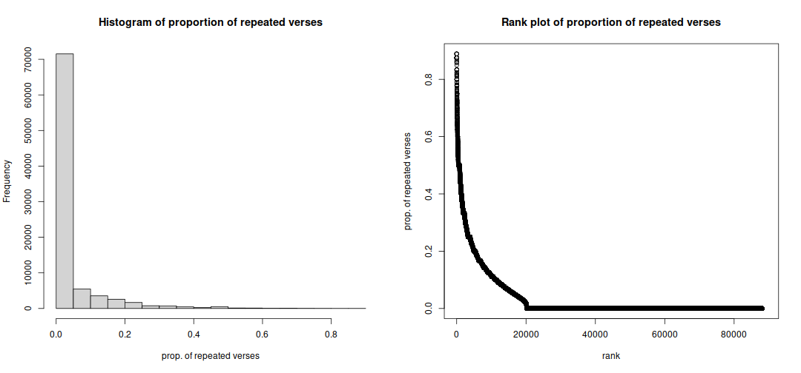
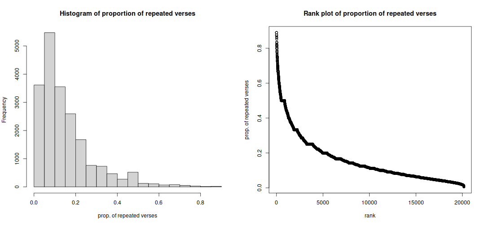
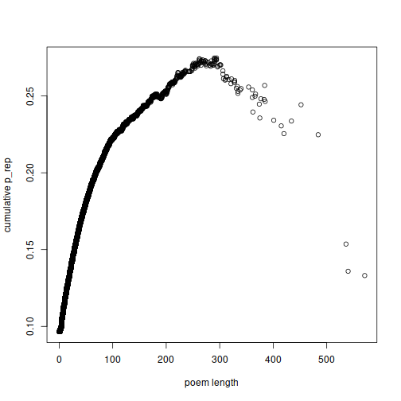
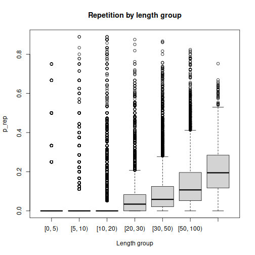
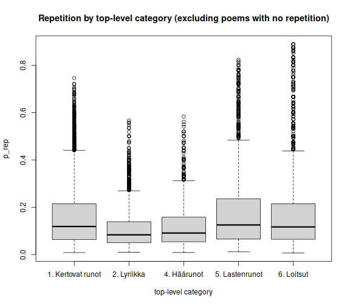
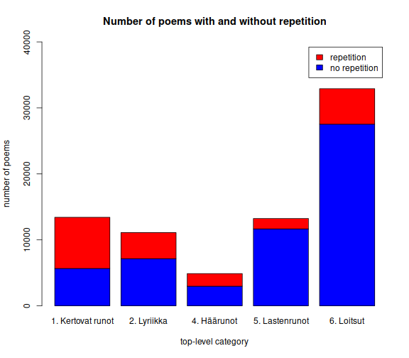
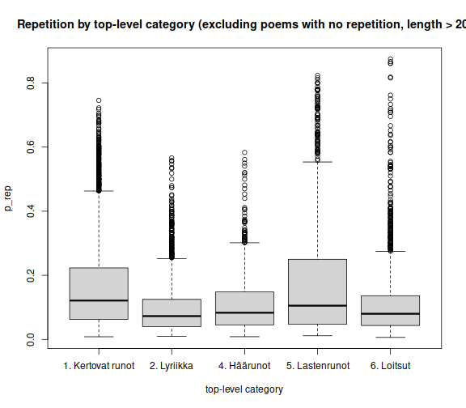
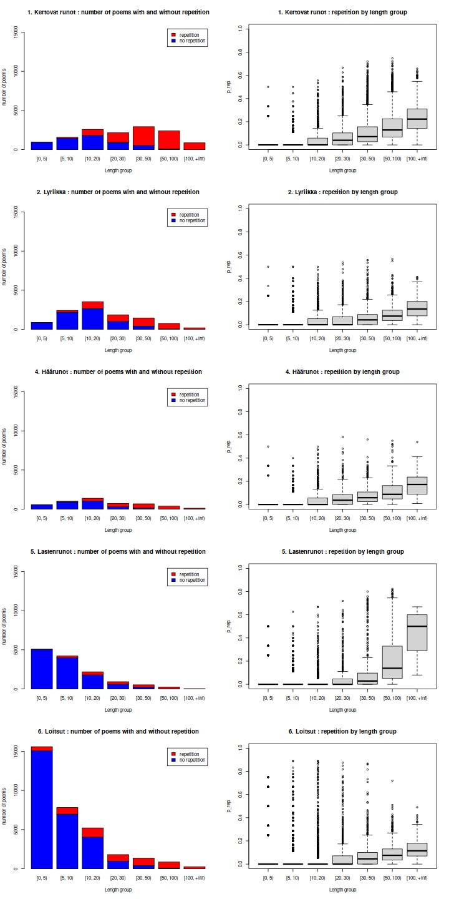

## General distribution of repetition

For all poems:



Excluding the poems with zero repetition:



## By poem length

Are longer poems more likely to contain repetition? The plots below
indicate that it is the case. Here, we plot the *cumulative p_rep* of
all poems longer than a certain length, against the given length.
The cumulative p_rep is calculated as:
```
p_rep = (sum(number_of_lines) - sum(number_of_clusters)) / sum(number_of_lines)
```
where the sum goes over all the poems longer than the chosen length.



The next plot shows the distribution of `p_rep` for different groups of poems,
where groups are based on length ranges.



## By top-level category







## By length and top-level category



## By type

Most repetetive types (only types containing at least 10 poems):

|types                                         |   n| avg_p_rep|examples                                                                       |
|:---------------------------------------------|---:|---------:|:------------------------------------------------------------------------------|
|Palvelin talonpoikaa vuoteni täyteen          | 120| 0.4756867|[0.8235](https://runoregi.rahtiapp.fi/poem?nro=skvr08135550); [0.8161](https://runoregi.rahtiapp.fi/poem?nro=skvr10115960); [0.8095](https://runoregi.rahtiapp.fi/poem?nro=skvr08135480); [0.8](https://runoregi.rahtiapp.fi/poem?nro=skvr08135360); [0.8](https://runoregi.rahtiapp.fi/poem?nro=skvr10115940); [0.7879](https://runoregi.rahtiapp.fi/poem?nro=skvr14116390); [0.7813](https://runoregi.rahtiapp.fi/poem?nro=skvr09122740); [0.78](https://runoregi.rahtiapp.fi/poem?nro=skvr08135450); [0.7794](https://runoregi.rahtiapp.fi/poem?nro=skvr13066230); [0.7778](https://runoregi.rahtiapp.fi/poem?nro=skvr10115920)|
|Läskinkantaja                                 |  18| 0.3908833|[0.7761](https://runoregi.rahtiapp.fi/poem?nro=skvr10114910); [0.7273](https://runoregi.rahtiapp.fi/poem?nro=skvr12112310); [0.6923](https://runoregi.rahtiapp.fi/poem?nro=skvr10114920); [0.6852](https://runoregi.rahtiapp.fi/poem?nro=skvr08134070); [0.6296](https://runoregi.rahtiapp.fi/poem?nro=skvr08134030); [0.6](https://runoregi.rahtiapp.fi/poem?nro=skvr08134060); [0.5926](https://runoregi.rahtiapp.fi/poem?nro=skvr08134040); [0.5789](https://runoregi.rahtiapp.fi/poem?nro=skvr10114900); [0.5](https://runoregi.rahtiapp.fi/poem?nro=skvr10114950); [0.425](https://runoregi.rahtiapp.fi/poem?nro=skvr10114970)|
|Muiden vaimoilla nenä                         |  13| 0.3197231|[0.5357](https://runoregi.rahtiapp.fi/poem?nro=skvr07131080); [0.4483](https://runoregi.rahtiapp.fi/poem?nro=skvr06104400); [0.4375](https://runoregi.rahtiapp.fi/poem?nro=skvr13065510); [0.3871](https://runoregi.rahtiapp.fi/poem?nro=skvr13120830); [0.381](https://runoregi.rahtiapp.fi/poem?nro=skvr06104390); [0.3636](https://runoregi.rahtiapp.fi/poem?nro=skvr04116350); [0.35](https://runoregi.rahtiapp.fi/poem?nro=skvr13120800); [0.25](https://runoregi.rahtiapp.fi/poem?nro=skvr13065500); [0.25](https://runoregi.rahtiapp.fi/poem?nro=skvr13120810); [0.25](https://runoregi.rahtiapp.fi/poem?nro=skvr13120820)|
|Velisurmaaja                                  |  15| 0.3097867|[0.5625](https://runoregi.rahtiapp.fi/poem?nro=skvr13013420); [0.5507](https://runoregi.rahtiapp.fi/poem?nro=skvr13013410); [0.4583](https://runoregi.rahtiapp.fi/poem?nro=skvr08110700); [0.4483](https://runoregi.rahtiapp.fi/poem?nro=skvr13013400); [0.4375](https://runoregi.rahtiapp.fi/poem?nro=skvr13013381); [0.4082](https://runoregi.rahtiapp.fi/poem?nro=skvr07113970); [0.4063](https://runoregi.rahtiapp.fi/poem?nro=skvr10101190); [0.3962](https://runoregi.rahtiapp.fi/poem?nro=skvr07113960); [0.25](https://runoregi.rahtiapp.fi/poem?nro=skvr13013380); [0.2](https://runoregi.rahtiapp.fi/poem?nro=skvr06103992)|
|Veneeseen pyrkivä neito                       |  39| 0.2640487|[0.7179](https://runoregi.rahtiapp.fi/poem?nro=skvr05111000); [0.675](https://runoregi.rahtiapp.fi/poem?nro=skvr02114200); [0.6458](https://runoregi.rahtiapp.fi/poem?nro=skvr05111040); [0.6389](https://runoregi.rahtiapp.fi/poem?nro=skvr05110950); [0.5663](https://runoregi.rahtiapp.fi/poem?nro=skvr04117070); [0.5588](https://runoregi.rahtiapp.fi/poem?nro=skvr13013600); [0.5143](https://runoregi.rahtiapp.fi/poem?nro=skvr05111020); [0.4906](https://runoregi.rahtiapp.fi/poem?nro=skvr04110170); [0.4583](https://runoregi.rahtiapp.fi/poem?nro=skvr05111030); [0.4444](https://runoregi.rahtiapp.fi/poem?nro=skvr02111840)|
|Hiihtävä surma                                |  27| 0.2521296|[0.5968](https://runoregi.rahtiapp.fi/poem?nro=skvr07109480); [0.5676](https://runoregi.rahtiapp.fi/poem?nro=skvr04112310); [0.5455](https://runoregi.rahtiapp.fi/poem?nro=skvr05111570); [0.4615](https://runoregi.rahtiapp.fi/poem?nro=skvr03102690); [0.4468](https://runoregi.rahtiapp.fi/poem?nro=skvr01110300); [0.4464](https://runoregi.rahtiapp.fi/poem?nro=skvr01110370); [0.44](https://runoregi.rahtiapp.fi/poem?nro=skvr01110280); [0.4348](https://runoregi.rahtiapp.fi/poem?nro=skvr03111090); [0.3571](https://runoregi.rahtiapp.fi/poem?nro=skvr01110340); [0.3182](https://runoregi.rahtiapp.fi/poem?nro=skvr04137780)|
|Sure sure hyvä rouva                          |  20| 0.2463500|[0.6111](https://runoregi.rahtiapp.fi/poem?nro=skvr04114870); [0.5333](https://runoregi.rahtiapp.fi/poem?nro=skvr04129760); [0.3833](https://runoregi.rahtiapp.fi/poem?nro=skvr12120060); [0.381](https://runoregi.rahtiapp.fi/poem?nro=skvr02105630); [0.375](https://runoregi.rahtiapp.fi/poem?nro=skvr03114400); [0.3462](https://runoregi.rahtiapp.fi/poem?nro=skvr04128840); [0.32](https://runoregi.rahtiapp.fi/poem?nro=skvr04108580); [0.3191](https://runoregi.rahtiapp.fi/poem?nro=skvr07143010); [0.2941](https://runoregi.rahtiapp.fi/poem?nro=skvr03114380); [0.25](https://runoregi.rahtiapp.fi/poem?nro=skvr10117050)|
|Pahan sulhon saanut                           | 101| 0.2427990|[0.675](https://runoregi.rahtiapp.fi/poem?nro=skvr07112600); [0.6316](https://runoregi.rahtiapp.fi/poem?nro=skvr02114240); [0.5882](https://runoregi.rahtiapp.fi/poem?nro=skvr07112560); [0.5455](https://runoregi.rahtiapp.fi/poem?nro=skvr01111640); [0.5](https://runoregi.rahtiapp.fi/poem?nro=skvr05112770); [0.4722](https://runoregi.rahtiapp.fi/poem?nro=skvr04129120); [0.4561](https://runoregi.rahtiapp.fi/poem?nro=skvr05110370); [0.439](https://runoregi.rahtiapp.fi/poem?nro=skvr05207640); [0.4375](https://runoregi.rahtiapp.fi/poem?nro=skvr02103680); [0.4375](https://runoregi.rahtiapp.fi/poem?nro=skvr02111390)|
|Taaton hyvyydet                               |  12| 0.2423000|[0.5143](https://runoregi.rahtiapp.fi/poem?nro=skvr07113730); [0.4444](https://runoregi.rahtiapp.fi/poem?nro=skvr07113120); [0.4286](https://runoregi.rahtiapp.fi/poem?nro=skvr07113720); [0.3571](https://runoregi.rahtiapp.fi/poem?nro=skvr07113750); [0.2941](https://runoregi.rahtiapp.fi/poem?nro=skvr07113760); [0.2857](https://runoregi.rahtiapp.fi/poem?nro=skvr07113770); [0.2692](https://runoregi.rahtiapp.fi/poem?nro=skvr07113780); [0.2353](https://runoregi.rahtiapp.fi/poem?nro=skvr07113710); [0.0789](https://runoregi.rahtiapp.fi/poem?nro=skvr07113130); [0](https://runoregi.rahtiapp.fi/poem?nro=skvr07113740)|
|Älä tule pakkanen tupaan                      | 102| 0.2421520|[0.6522](https://runoregi.rahtiapp.fi/poem?nro=skvr06104190); [0.625](https://runoregi.rahtiapp.fi/poem?nro=skvr08129960); [0.5789](https://runoregi.rahtiapp.fi/poem?nro=skvr06104130); [0.5625](https://runoregi.rahtiapp.fi/poem?nro=skvr10107430); [0.5385](https://runoregi.rahtiapp.fi/poem?nro=skvr13116400); [0.5172](https://runoregi.rahtiapp.fi/poem?nro=skvr04136860); [0.5](https://runoregi.rahtiapp.fi/poem?nro=skvr13116360); [0.5](https://runoregi.rahtiapp.fi/poem?nro=skvr14109660); [0.4615](https://runoregi.rahtiapp.fi/poem?nro=skvr09118350); [0.4483](https://runoregi.rahtiapp.fi/poem?nro=skvr07136090)|
|Kultasilta taatolle, olkisilta sulholle       |  73| 0.2399959|[0.625](https://runoregi.rahtiapp.fi/poem?nro=skvr03116180); [0.625](https://runoregi.rahtiapp.fi/poem?nro=skvr13032940); [0.6176](https://runoregi.rahtiapp.fi/poem?nro=skvr07126310); [0.6061](https://runoregi.rahtiapp.fi/poem?nro=skvr05112330); [0.6061](https://runoregi.rahtiapp.fi/poem?nro=skvr05212540); [0.6](https://runoregi.rahtiapp.fi/poem?nro=skvr01114440); [0.6](https://runoregi.rahtiapp.fi/poem?nro=skvr07126400); [0.5897](https://runoregi.rahtiapp.fi/poem?nro=skvr13032810); [0.5862](https://runoregi.rahtiapp.fi/poem?nro=skvr13032850); [0.5625](https://runoregi.rahtiapp.fi/poem?nro=skvr13032920)|
|Hyvä iltaa kultaseni, anna kättä              |  17| 0.2395353|[0.5556](https://runoregi.rahtiapp.fi/poem?nro=skvr04110920); [0.5](https://runoregi.rahtiapp.fi/poem?nro=skvr13072110); [0.4](https://runoregi.rahtiapp.fi/poem?nro=skvr13072080); [0.3939](https://runoregi.rahtiapp.fi/poem?nro=skvr13072150); [0.375](https://runoregi.rahtiapp.fi/poem?nro=skvr13072050); [0.35](https://runoregi.rahtiapp.fi/poem?nro=skvr13072210); [0.3226](https://runoregi.rahtiapp.fi/poem?nro=skvr13072140); [0.25](https://runoregi.rahtiapp.fi/poem?nro=skvr13072100); [0.2222](https://runoregi.rahtiapp.fi/poem?nro=skvr13124060); [0.1667](https://runoregi.rahtiapp.fi/poem?nro=skvr13072090)|
|Lunastettava neito                            | 300| 0.2373903|[0.7](https://runoregi.rahtiapp.fi/poem?nro=skvr09100340); [0.6423](https://runoregi.rahtiapp.fi/poem?nro=skvr01110870); [0.6034](https://runoregi.rahtiapp.fi/poem?nro=skvr05105100); [0.6024](https://runoregi.rahtiapp.fi/poem?nro=skvr01221880); [0.6](https://runoregi.rahtiapp.fi/poem?nro=skvr06102320); [0.6](https://runoregi.rahtiapp.fi/poem?nro=skvr07111630); [0.5938](https://runoregi.rahtiapp.fi/poem?nro=skvr10100560); [0.5914](https://runoregi.rahtiapp.fi/poem?nro=skvr05105060); [0.5905](https://runoregi.rahtiapp.fi/poem?nro=skvr01221870); [0.589](https://runoregi.rahtiapp.fi/poem?nro=skvr09100320)|
|Tuonelta kosinta                              | 106| 0.2292953|[0.6143](https://runoregi.rahtiapp.fi/poem?nro=skvr03106580); [0.6143](https://runoregi.rahtiapp.fi/poem?nro=skvr03120480); [0.5965](https://runoregi.rahtiapp.fi/poem?nro=skvr03132820); [0.5862](https://runoregi.rahtiapp.fi/poem?nro=skvr03134390); [0.5729](https://runoregi.rahtiapp.fi/poem?nro=skvr03112180); [0.5481](https://runoregi.rahtiapp.fi/poem?nro=skvr03112140); [0.5395](https://runoregi.rahtiapp.fi/poem?nro=skvr03127930); [0.5217](https://runoregi.rahtiapp.fi/poem?nro=skvr03106600); [0.5198](https://runoregi.rahtiapp.fi/poem?nro=skvr03112200); [0.5082](https://runoregi.rahtiapp.fi/poem?nro=skvr15110360)|
|Marjatiellä kadonnut tyttö                    |  12| 0.2247917|[0.5938](https://runoregi.rahtiapp.fi/poem?nro=skvr04129920); [0.5625](https://runoregi.rahtiapp.fi/poem?nro=skvr04108410); [0.5](https://runoregi.rahtiapp.fi/poem?nro=skvr05107500); [0.3478](https://runoregi.rahtiapp.fi/poem?nro=skvr05105800); [0.3043](https://runoregi.rahtiapp.fi/poem?nro=skvr04115650); [0.2258](https://runoregi.rahtiapp.fi/poem?nro=skvr06101030); [0.1437](https://runoregi.rahtiapp.fi/poem?nro=skvr07121630); [0.0196](https://runoregi.rahtiapp.fi/poem?nro=skvr04137570); [0](https://runoregi.rahtiapp.fi/poem?nro=skvr04137580); [0](https://runoregi.rahtiapp.fi/poem?nro=skvr04137590)|
|Itketkö sinä minua?                           |  32| 0.2245156|[0.7222](https://runoregi.rahtiapp.fi/poem?nro=skvr05101150); [0.675](https://runoregi.rahtiapp.fi/poem?nro=skvr04124060); [0.55](https://runoregi.rahtiapp.fi/poem?nro=skvr05113410); [0.5](https://runoregi.rahtiapp.fi/poem?nro=skvr07109320); [0.3714](https://runoregi.rahtiapp.fi/poem?nro=skvr04111650); [0.3714](https://runoregi.rahtiapp.fi/poem?nro=skvr04126120); [0.3548](https://runoregi.rahtiapp.fi/poem?nro=skvr04122410); [0.3438](https://runoregi.rahtiapp.fi/poem?nro=skvr04107970); [0.3077](https://runoregi.rahtiapp.fi/poem?nro=skvr04106500); [0.2647](https://runoregi.rahtiapp.fi/poem?nro=skvr13000110)|
|Varkaalle menijä                              | 116| 0.2179741|[0.5763](https://runoregi.rahtiapp.fi/poem?nro=skvr04139650); [0.5469](https://runoregi.rahtiapp.fi/poem?nro=skvr05110270); [0.5385](https://runoregi.rahtiapp.fi/poem?nro=skvr04130440); [0.5106](https://runoregi.rahtiapp.fi/poem?nro=skvr04123840); [0.5](https://runoregi.rahtiapp.fi/poem?nro=skvr04127220); [0.5](https://runoregi.rahtiapp.fi/poem?nro=skvr04138690); [0.5](https://runoregi.rahtiapp.fi/poem?nro=skvr07112880); [0.5](https://runoregi.rahtiapp.fi/poem?nro=skvr13013280); [0.4828](https://runoregi.rahtiapp.fi/poem?nro=skvr03124070); [0.4773](https://runoregi.rahtiapp.fi/poem?nro=skvr13013200)|
|Oma taatto heittäminen, ukko omaksi ottaminen |  36| 0.2167861|[0.4699](https://runoregi.rahtiapp.fi/poem?nro=skvr01117310); [0.3943](https://runoregi.rahtiapp.fi/poem?nro=skvr02105440); [0.3403](https://runoregi.rahtiapp.fi/poem?nro=skvr01116600); [0.3197](https://runoregi.rahtiapp.fi/poem?nro=skvr02105520); [0.3117](https://runoregi.rahtiapp.fi/poem?nro=skvr01117410); [0.3087](https://runoregi.rahtiapp.fi/poem?nro=skvr01116861); [0.2898](https://runoregi.rahtiapp.fi/poem?nro=skvr01116750); [0.2897](https://runoregi.rahtiapp.fi/poem?nro=skvr02105410); [0.2727](https://runoregi.rahtiapp.fi/poem?nro=skvr03133010); [0.2651](https://runoregi.rahtiapp.fi/poem?nro=skvr01116860)|
|Onkos teillä Osmolassa?                       |  19| 0.2159684|[0.4667](https://runoregi.rahtiapp.fi/poem?nro=skvr13009510); [0.3333](https://runoregi.rahtiapp.fi/poem?nro=skvr05112620); [0.3333](https://runoregi.rahtiapp.fi/poem?nro=skvr05216650); [0.3226](https://runoregi.rahtiapp.fi/poem?nro=skvr13009530); [0.3125](https://runoregi.rahtiapp.fi/poem?nro=skvr05112630); [0.3125](https://runoregi.rahtiapp.fi/poem?nro=skvr05216660); [0.2778](https://runoregi.rahtiapp.fi/poem?nro=skvr05216600); [0.25](https://runoregi.rahtiapp.fi/poem?nro=skvr05216620); [0.25](https://runoregi.rahtiapp.fi/poem?nro=skvr05216630); [0.2414](https://runoregi.rahtiapp.fi/poem?nro=skvr04106830)|
|Tuonelassa käynti                             |  59| 0.2136068|[0.5361](https://runoregi.rahtiapp.fi/poem?nro=skvr01103611); [0.5208](https://runoregi.rahtiapp.fi/poem?nro=skvr01103510); [0.475](https://runoregi.rahtiapp.fi/poem?nro=skvr01103612); [0.463](https://runoregi.rahtiapp.fi/poem?nro=skvr01103800); [0.4545](https://runoregi.rahtiapp.fi/poem?nro=skvr01103770); [0.4512](https://runoregi.rahtiapp.fi/poem?nro=skvr01103610); [0.4444](https://runoregi.rahtiapp.fi/poem?nro=skvr01103640); [0.4356](https://runoregi.rahtiapp.fi/poem?nro=skvr01103700); [0.4231](https://runoregi.rahtiapp.fi/poem?nro=skvr01221450); [0.4133](https://runoregi.rahtiapp.fi/poem?nro=skvr01106690)|

TODO questions:
- for poems with high repetition, do the repeating lines always repeat? or is it possible for them to also be "individual lines" in another poem?

## By location


